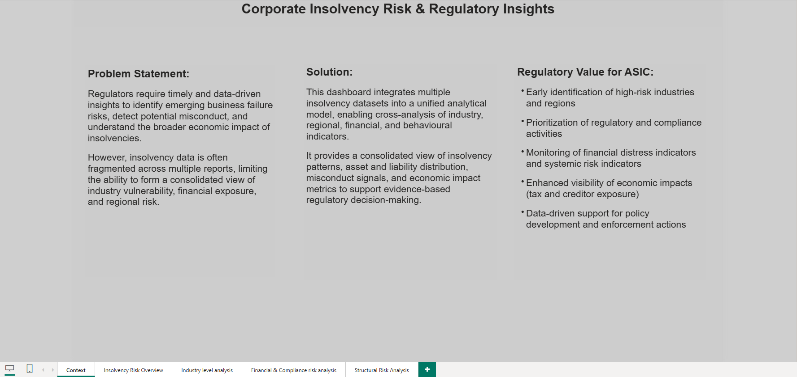
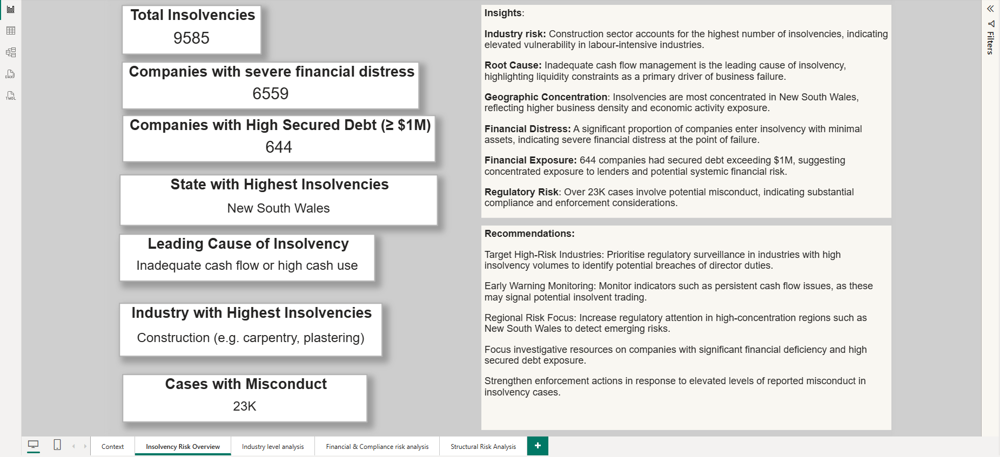
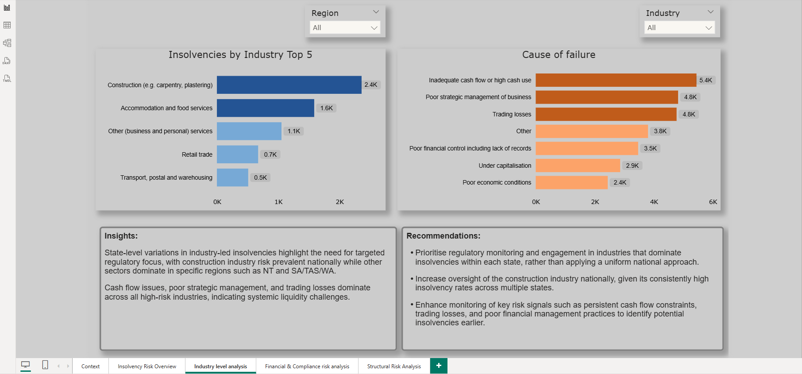
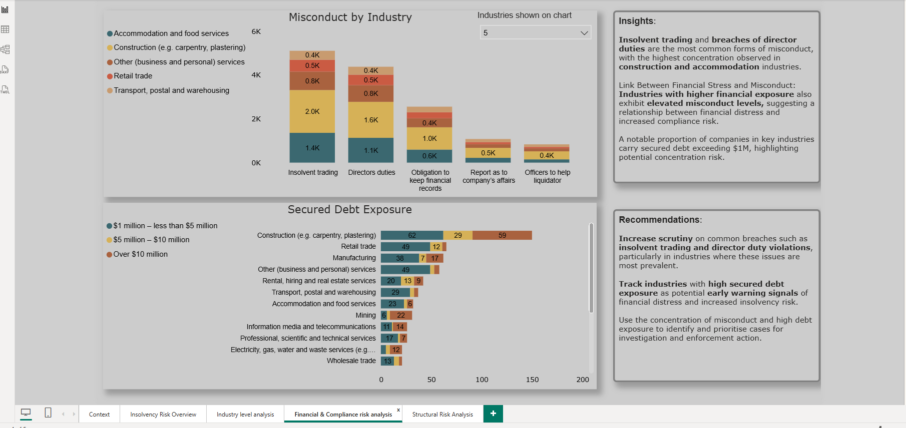
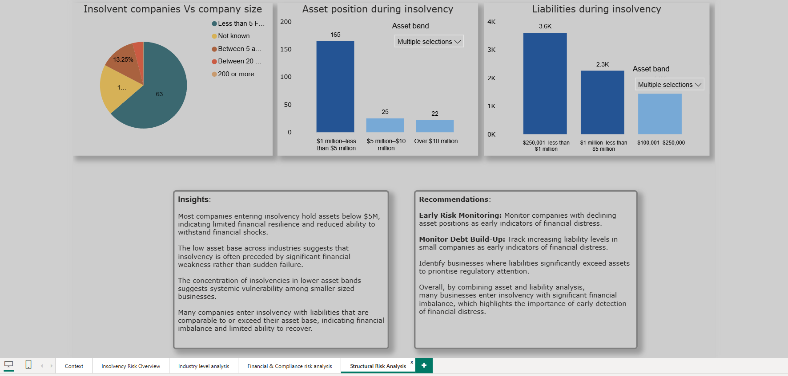

# Insolvency Trends & Industry Risk Insights (Australia)

## Overview

This project presents an interactive Power BI dashboard analysing insolvency trends across Australia using ASIC data. The dashboard demonstrates the ability to translate complex datasets into actionable insights that can support policy development, regulatory focus, and strategic decision-making.

## 📸 Dashboard Preview  

  
  
  
  
  

## Data Source

* Data sourced from the Australian Securities & Investments Commission (ASIC) insolvency statistics
* Publicly available datasets covering company insolvencies across industries, states, and financial metrics
* Data includes information on insolvency type, industry classification, assets, liabilities, and employee size (FTE)

## Key Features

State-level insolvency trends analysis

Industry-level risk identification

Assets vs liabilities comparison

Workforce (FTE) analysis to assess company size impact

Misconduct trends across industries

Cause of failure analysis

## Tools & Technologies

Power BI, DAX, Data Modelling, Excel

## End-to-end process

Research and Data collection: Collected and transformed ASIC insolvency data to create a structured dataset suitable for analysis

Data cleaning, transformation, validation: Performed data cleaning and preprocessing, standardising categories, unpivoting, filtering, validated data types, renamed the columns. 

Development: Designed and developed an interactive Power BI dashboard to analyse insolvency trends across states and industrie
* Built calculated measures using DAX (e.g., total insolvencies, YoY growth, industry-wise distribution) to enable dynamic analysis
* Conducted exploratory data analysis to identify key risk patterns across industries, financial metrics (assets & liabilities), and workforce size (FTE)
* Designed and implemented an end-to-end Power BI solution to analyse insolvency trends across industries, states, and financial metrics, comparing the cause of failure and misconduct reasons. 
* Conducted in-depth exploratory analysis to uncover key drivers of insolvency, including industry risk concentration, financial stress indicators, identifying the early signals, misconduct reasons and top causes of failure.
* Produced data visualisations to support stakeholder understanding of complex trends and regional variation.
* Delivered evidence-based insights to inform potential regulatory focus areas and resource prioritisation
* Applied best practices in dashboard design to ensure clarity, usability, and effective storytelling
